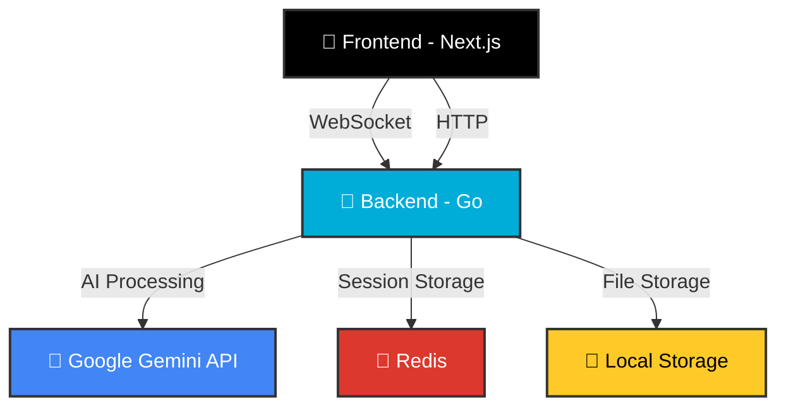

<!-- Improved Aesthetic README with Emojis and Badges -->

<div align="center">
  
  
  
  # 🌌 Aether: AI-Driven Data Analysis Platform
  
  [](https://opensource.org/licenses/MIT)
  [](https://golang.org/)
  [](https://nextjs.org/)
  [](https://www.docker.com/)
  [](https://redis.io/)
  
  **Transform your data into insights through conversational AI and interactive visualizations**
  
  [Key Features](#-key-features) •
  [Demo](#-demo) •
  [Quick Start](#-quick-start) •
  [Tech Stack](#-tech-stack) •
  [Architecture](#-architecture)
  
</div>

---

## 🚀 Project Overview

**Aether** is an advanced, AI-driven web application that enables users to have intuitive, conversational dialogues with their data. Upload datasets (CSV files) and ask complex questions in plain English. The AI agent, powered by Google's Gemini, responds with text and dynamically generated interactive charts. The most innovative feature is the **visual query loop** where users can circle points on charts and ask follow-up questions.

### 🎯 Why Aether?

- 🔍 **No Technical Expertise Required** - Analyze complex datasets with natural language
- 📊 **AI-Powered Insights** - Get intelligent visualizations and data interpretations
- 🔄 **Interactive Exploration** - Circle areas on charts and dive deeper with follow-up questions
- ⚡ **Real-time Responses** - Experience streaming AI responses as they're generated
- 🌐 **Multi-modal Interaction** - Combine text and visual inputs for comprehensive analysis

---

## ✨ Key Features

| Feature | Description |
|--------|-------------|
| 💬 **Conversational Data Analysis** | Upload CSV files and ask questions in natural language |
| 📈 **AI-Powered Visualizations** | Generate interactive charts using ECharts |
| 🎯 **Visual Query Loop** | Circle areas on charts and ask follow-up questions |
| ⚡ **Real-time Streaming Responses** | Get AI responses as they're generated |
| 🔄 **Multi-modal Interaction** | Combine text and visual inputs for deeper analysis |
| 💾 **Session Persistence** | Redis-backed session storage for maintaining context |
| 📱 **Responsive UI** | Modern, responsive interface built with Next.js and Tailwind CSS |

---

## 🎥 Demo

https://github.com/utsavsaxena2004/Aether/assets/12345678/demo-video.mp4

> *Upload a CSV file, ask questions about your data, and explore insights through interactive visualizations!*

---

## 🛠 Quick Start

### 📋 Prerequisites

- Docker and Docker Compose
- Google Gemini API Key (for AI features)
- Node.js >=18.0.0 (for local development)
- pnpm >=8.0.0 (for local development)
- Go >=1.22 (for local development)

### 🚀 Getting Started

#### 1. Clone the Repository

```bash
git clone https://github.com/utsavsaxena2004/Aether.git
cd Aether
```

#### 2. Set Up Environment Variables

Create a `.env` file in the `synaptic-core` directory:

```bash
cp synaptic-core/.env.example synaptic-core/.env
```

Then edit `synaptic-core/.env` and add your Google Gemini API key:

```env
GEMINI_API_KEY=your_google_gemini_api_key_here
```

#### 3. Start the Application

**Using Docker (Recommended)**

```bash
# On Unix/Linux/macOS
./scripts/dev.sh start

# On Windows
scripts\dev.bat start
```

**Or directly with Docker Compose:**

```bash
docker-compose up --build
```

#### 4. Access the Application

- **Frontend**: http://localhost:3000 (or http://localhost:3001 if 3000 is in use)
- **Backend API**: http://localhost:8080
- **WebSocket**: ws://localhost:8080/ws

---

## 🏗 Tech Stack

<div align="center">
  
| Layer | Technology | Purpose |
|-------|------------|---------|
| **Frontend** |  | React framework with App Router |
| |  | Type-safe JavaScript |
| |  | Utility-first CSS framework |
| |  | Interactive data visualizations |
| |  | State management |
| **Backend** |  | High-performance backend |
| |  | Real-time communication |
| |  | Session caching |
| |  | AI language processing |
| **DevOps** |  | Containerization |
| |  | Reverse proxy |

</div>

---

## 🏗 Architecture

Aether follows a **microservices architecture** designed for scalability and maintainability:



### 🧩 Key Components

- **Frontend** (`interactive-carapace`): Next.js 14+ with TypeScript and Tailwind CSS
- **Backend** (`synaptic-core`): Go with Gorilla WebSocket for real-time communication
- **AI Engine**: Google Gemini API for natural language processing
- **Data Storage**: Redis for session caching
- **Visualization**: ECharts for interactive data visualizations

---

## 📁 Project Structure

```
Aether/
├── 🧠 synaptic-core/          # Go backend service
│   ├── handlers/              # HTTP and WebSocket handlers
│   ├── models/                # Data models and WebSocket hub
│   ├── services/              # Business logic and external services
│   ├── utils/                 # Utility functions
│   ├── main.go                # Application entry point
│   └── Dockerfile             # Backend Docker configuration
├── 🎨 interactive-carapace/   # Next.js frontend
│   ├── src/                   # Source code
│   │   ├── app/               # App router pages
│   │   ├── components/        # React components
│   │   ├── hooks/             # Custom hooks
│   │   ├── store/             # Zustand store
│   │   └── types/             # TypeScript types
│   └── Dockerfile             # Frontend Docker configuration
├── 📜 scripts/                # Development scripts
└── 🐳 docker-compose.yml      # Docker Compose configuration
```

---

## 📊 Features Implementation Status

- [x] 🏗 Project Scaffolding & Monorepo Setup
- [x] 🔌 Backend HTTP Server & Health Check
- [x] 🔄 Real-time WebSocket Hub Implementation
- [x] 🎨 Frontend Scaffolding & UI/UX Foundation
- [x] 🌐 Frontend WebSocket Client Integration
- [x] 💾 State Management for Chat
- [x] 📥 Data Ingestion & Pre-processing
- [x] 🤖 Basic Prompt Engineering & Text Generation
- [x] 📈 Advanced Prompt Engineering for Chart Generation
- [x] 📊 Dynamic Visualization Rendering
- [x] 🎯 Multi-modal Visual Query Loop
- [x] ⚡ Streaming AI Responses
- [x] 🐳 Application Containerization
- [x] 🛠 Local Development Orchestration
- [x] 💾 Session Persistence with Redis
- [x] 🎨 Enhanced UI/UX and Error Handling

---

## 🌐 API Endpoints

### Backend HTTP Endpoints

- `GET /health` - Health check endpoint
- `GET /` - API root with status information
- `POST /upload` - File upload endpoint
- `GET /data-summary` - Get data summary for current session

### WebSocket Endpoints

- `ws://localhost:8080/ws` - WebSocket connection for real-time communication

**WebSocket message types:**
- `chat` - Text messages between user and AI
- `chart_spec` - Chart specification data from AI
- `visual_query` - Visual selection queries from user
- `error` - Error messages
- `system` - System messages

---

## 🛠 Development Workflow

### 🎨 Frontend Development

```bash
cd interactive-carapace
pnpm dev  # Hot-reloading development server
# Access at http://localhost:3000
```

### 🔧 Backend Development

```bash
cd synaptic-core
go run main.go  # Start the server
# Server runs on http://localhost:8080
```

### 🌐 Full Stack Development

```bash
# Use Docker Compose for running all services together
./scripts/dev.sh start  # Unix/Linux/macOS
scripts\dev.bat start   # Windows
```

---

## 🤝 Contributing

We love contributions! Here's how you can help:

1. 🍴 Fork the repository
2. 🌿 Create your feature branch (`git checkout -b feature/AmazingFeature`)
3. 💻 Commit your changes (`git commit -m 'Add some AmazingFeature'`)
4. 🚀 Push to the branch (`git push origin feature/AmazingFeature`)
5. 📬 Open a pull request

### 📋 Development Scripts

**Unix/Linux/macOS**
```bash
./scripts/dev.sh start    # Start services
./scripts/dev.sh stop     # Stop services
./scripts/dev.sh restart  # Restart services
./scripts/dev.sh logs     # View logs
./scripts/dev.sh status   # Show service status
./scripts/dev.sh test     # Run tests
```

**Windows**
```cmd
scripts\dev.bat start    # Start services
scripts\dev.bat stop     # Stop services
scripts\dev.bat restart  # Restart services
scripts\dev.bat logs     # View logs
scripts\dev.bat status   # Show service status
scripts\dev.bat test     # Run tests
```

---

## 📄 License

This project is licensed under the MIT License - see the [LICENSE](LICENSE) file for details.

---

<div align="center">
  
  Made with ❤️ by the Aether Team
  
  [](https://github.com/utsavsaxena2004/Aether)
  [](https://github.com/utsavsaxena2004/Aether/issues)
  [](https://github.com/utsavsaxena2004/Aether/pulls)
  
</div>